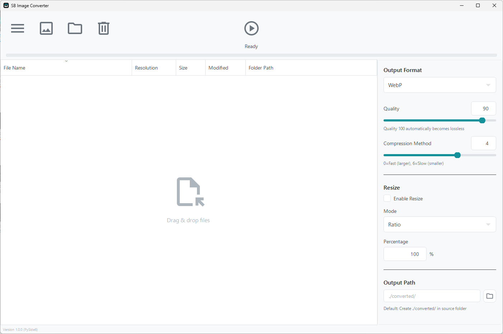
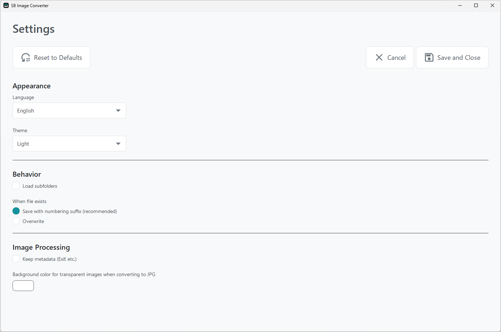
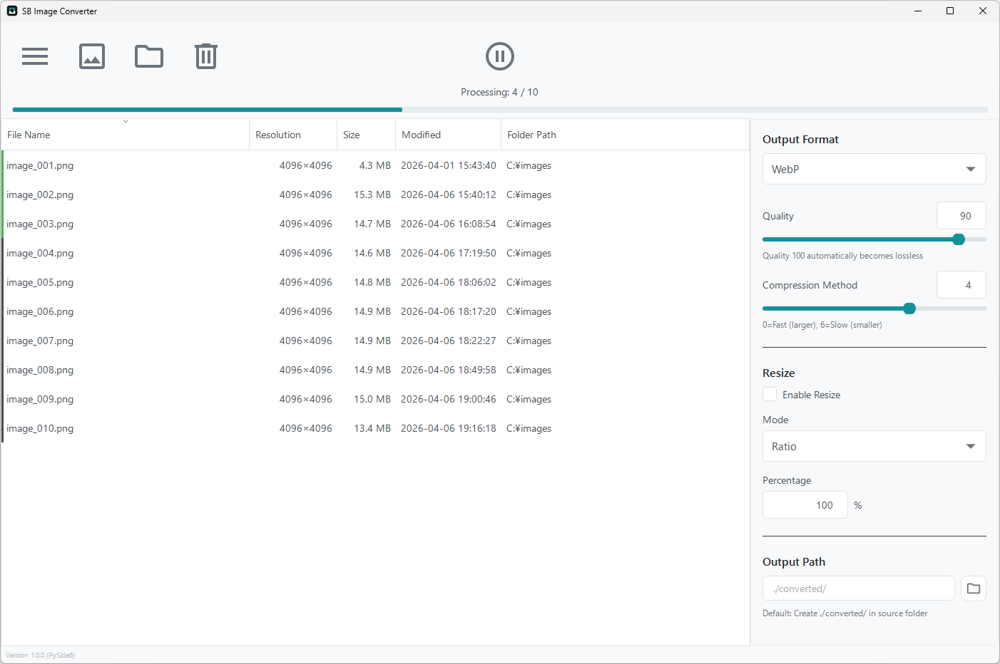
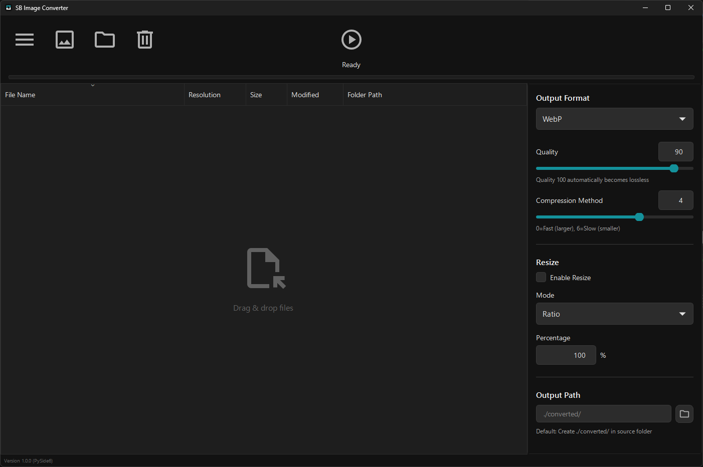
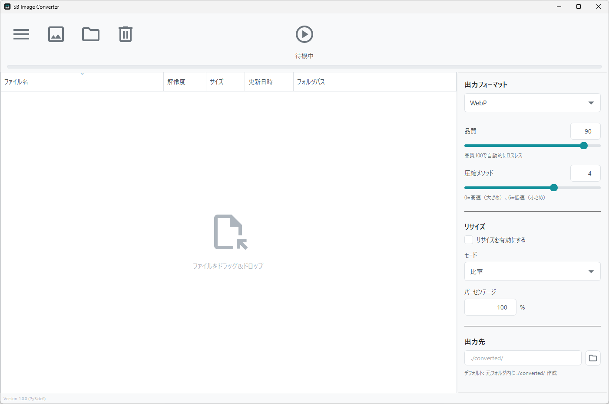

# SB Image Converter

A simple and efficient batch image converter for Windows with format conversion and resize capabilities.

## Download

Download the latest release from the [Releases](https://github.com/Amatsukast/SB-Image-Converter/releases) page.

**How to Run:**

1. Download `SB-Image-Converter-v1.0.1.zip` from Releases
2. Extract the zip file
3. Run `SB Image Converter.exe`

No installation required.

## System Requirements

- **OS**: Windows 10 or later (64-bit)
- **RAM**: 4GB or more (recommended for processing large images)
- **Disk Space**: ~150MB for the application

## Overview

  

SB Image Converter is a batch image processing tool with comprehensive format conversion and resizing capabilities.

### Supported Formats

- **WebP** - Modern web image format with superior compression
- **PNG** - Lossless format with transparency support
- **JPG/JPEG** - Universal format with adjustable quality
- **BMP** - Uncompressed bitmap format

### Resize Modes

Choose from 4 flexible resize options:

- **Percentage (Ratio)** - Scale by percentage (1-500%)
  - Example: 50% reduces a 1000x800 image to 500x400
- **Fixed Pixels** - Set exact width and height in pixels
  - Example: Resize all images to 1920x1080
- **Long Edge** - Scale based on the longer dimension
  - Example: 1000px long edge converts 2000x1500 → 1000x750
- **Short Edge** - Scale based on the shorter dimension
  - Example: 500px short edge converts 2000x1500 → 667x500

### Quality Control

**WebP Settings:**

- Quality: 0-100 (100 = lossless)
- Compression Method: 0 (fast) to 6 (slow but smaller file size)

**PNG Settings:**

- Compression Level: 0 (no compression) to 9 (maximum compression)
- Optimization: Enable for smaller file size with slower processing

**JPG Settings:**

- Quality: 0-100 (higher = better quality, larger file)
- Subsampling: 4:4:4 (best quality) / 4:2:2 / 4:2:0 (smallest size)
- Progressive: Enable for progressive loading on web

### Additional Features

- **Metadata Management**: Choose to keep or remove EXIF data (camera info, GPS, etc.)
- **Drag & Drop**: Simply drag images into the window
- **Batch Processing**: Convert hundreds of images at once
- **Smart Output**: Automatic file numbering when duplicates exist
- **Output Path**: Choose custom output folder or use default `./converted/` in source folder

## Settings

  

Access settings via the menu button (☰) in the top-left corner.

### Appearance

- **Language**: Switch between English and Japanese
- **Theme**: Choose Light or Dark mode

### Behavior

- **Load subfolders**: Include images from subfolders when adding a folder
- **When file exists**:
  - Save with numbering suffix (recommended) - Adds \_1, \_2, etc.
  - Overwrite - Replaces existing files

### Image Processing

- **Keep metadata (Exif, etc.)**: Preserve camera information, GPS data, and other metadata
- **Background color for transparent images when converting to JPG**: Set the background color for images with transparency (default: white)

## How to Use

  

1. **Add Images**
   - Drag & drop images into the window, or
   - Click the folder icon (📁) to select files/folders
   - Click the image icon (🖼️) to add individual images

2. **Configure Settings**
   - Select **Output Format** (WebP/PNG/JPG/BMP)
   - Adjust **Quality** slider for the selected format
   - Enable **Resize** if needed and choose resize mode
   - Set **Output Path** (leave blank for default `./converted/`)

3. **Start Conversion**
   - Click the **Play button** (▶️) to start
   - Monitor progress in the status bar
   - Use **Pause** (⏸️) to pause/resume
   - Right-click on files to remove them from the list

The application shows real-time progress including file count (e.g., "Processing: 6 / 10") and displays detailed information for each file (resolution, size, modification date).

## Dark Mode Support

  

Switch to Dark mode via Settings for a comfortable viewing experience in low-light environments. The theme is applied immediately and persists across sessions.

## 日本語対応

  

SB Image Converterは日本語UIに完全対応しています。

**主な機能:**

- WebP、PNG、JPG、BMP形式の相互変換
- 一括変換機能（ドラッグ&ドロップ対応）
- 4種類のリサイズモード（比率、ピクセル指定、長辺基準、短辺基準）
- フォーマット別の詳細な品質設定
- メタデータ（Exif情報）の保持/削除
- ダークモード/ライトモード対応

**使い方:**

1. 画像をドラッグ&ドロップ、またはフォルダ/画像アイコンから追加
2. 出力フォーマットと品質を設定
3. 必要に応じてリサイズを有効化してモードを選択
4. 出力先を設定（空欄の場合は元フォルダ内の `./converted/`）
5. 再生ボタン（▶️）をクリックして変換開始

**言語の切り替え:**

設定画面（左上のメニューボタン ☰）→ Appearance → Language から「日本語」を選択してください。

## License

This project is licensed under the **GNU General Public License v3.0**. See [LICENSE](LICENSE) for details.

**Third-Party Libraries:**

- [PySide6](https://www.qt.io/qt-for-python) (LGPL v3)
- [Pillow](https://python-pillow.org/) (MIT-CMU)

## Bug Reports & Feature Requests

Found a bug or have a feature request? Please open an issue on [GitHub Issues](https://github.com/Amatsukast/SB-Image-Converter/issues).

## Author

**Amatsukast**  
GitHub: [@Amatsukast](https://github.com/Amatsukast)

---

**Version 1.0.1** | Released 2026-04-30
